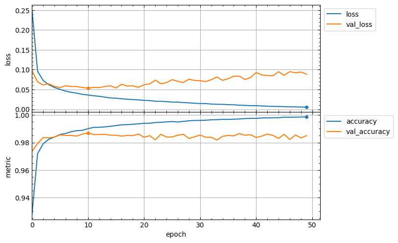

# lcurvetools
Simple tools to plot learning curves of a neural network model trained with the keras or scikit-learn framework.

## The `lcurves_by_history` function to plot learning curves by the `history` attribute of the keras `History` object

Neural network model training with keras is performed using the [fit](https://keras.io/api/models/model_training_apis/#fit-method) method. The method returns the `History` object with the `history` attribute which is dictionary and contains keys with training and validation values of losses and metrics, as well as learning rate values at successive epochs. The `lcurves_by_history` function uses the `History.history` dictionary to plot the learning curves as the dependences of the above values on the epoch index.

### Usage scheme
- Import the `keras` module and the `lcurves_by_history` function:
```python
import keras
from lcurvetools import lcurves_by_history
```
- [Create](https://keras.io/api/models/), [compile](https://keras.io/api/models/model_training_apis/#compile-method)
and [fit](https://keras.io/api/models/model_training_apis/#fit-method) the keras model:
```python
model = keras.Model(...) # or keras.Sequential(...)
model.compile(...)
hist = model.fit(...)
```
- Use `hist.history` dictionary to plot the learning curves as the dependences of values of all keys in the dictionary on an epoch index with automatic recognition of keys of losses, metrics and learning rate:
```python
lcurves_by_history(hist.history)
```
The appearance of the output plot depends on the list of keys in the `hist.history` dictionary, which is determined by the parameters of the `compile` and `fit` methods. For example, for a typical usage of these methods, the list of keys would be `['loss', 'accuracy', 'val_loss', 'val_accuracy']` and the output plot might look like this:
```python
model.compile(loss="categorical_crossentropy", metrics=["accuracy"])
hist = model.fit(x_train, y_train, validation_split=0.1, epochs=50)
lcurves_by_history(hist.history);
```
