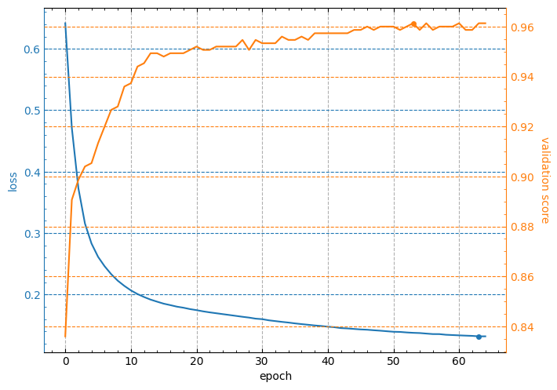
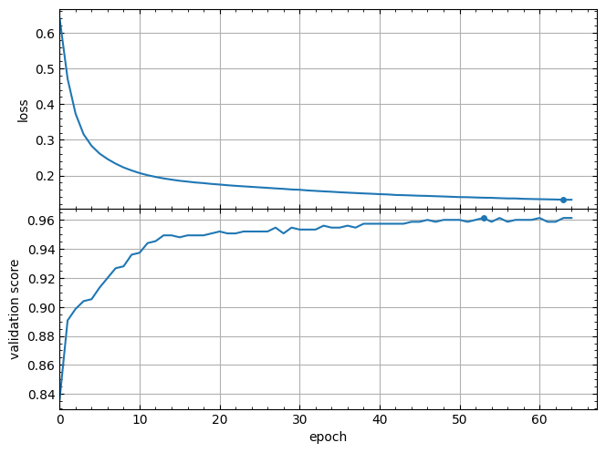
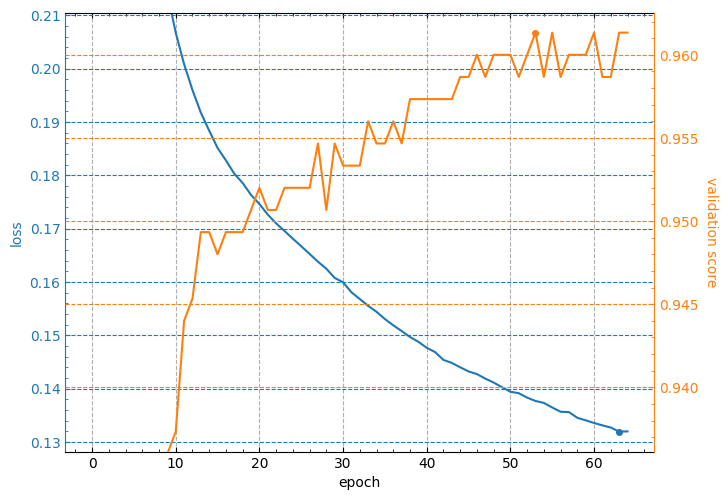

# lcurvetools

Simple Python tools for plotting learning curves of neural network models trained with the keras or scikit-learn framework in a single figure in an easy-to-understand format.

Currently the `lcurvetools` package provides three functions: `lcurves_by_history`, `history_concatenate` and `lcurves_by_MLP_estimator`.

**NOTE:** All of the plotting examples below are for [interactive Python mode](https://matplotlib.org/stable/users/explain/figure/interactive.html#interactive-mode) in Jupyter-like environments. If you are in non-interactive mode you may need to explicitly call [`plt.show()`](https://matplotlib.org/stable/api/_as_gen/matplotlib.pyplot.show.html) after calling the `lcurves_by_history` or `lcurves_by_MLP_estimator` function to display the window with built plots on your screen.

## Table of contents

- [Installation](#installation)
- [The `lcurves_by_history` function to plot learning curves by the `history` attribute of the keras `History` object](#the-lcurves_by_history-function-to-plot-learning-curves-by-the-history-attribute-of-the-keras-history-object)
  - [Usage scheme](#usage-scheme)
    - [Plotting learning curves of one model based on one dictionary](#plotting-learning-curves-of-one-model-based-on-one-dictionary)
    - [Plotting learning curves based on a list of dictionaries with fitting histories of several models](#plotting-learning-curves-based-on-a-list-of-dictionaries-with-fitting-histories-of-several-models)
    - [Plotting learning curves based on a list of dictionaries with independent refitting histories of one model](#plotting-learning-curves-based-on-a-list-of-dictionaries-with-independent-refitting-histories-of-one-model)
  - [Typical appearance of the output figure](#typical-appearance-of-the-output-figure)
  - [Customizing appearance of the output figure](#customizing-appearance-of-the-output-figure)
- [The `history_concatenate` function to concatenate two `History.history` dictionaries](#the-history_concatenate-function-to-concatenate-two-historyhistory-dictionaries)
  - [Usage scheme](#usage-scheme-1)
- [The `lcurves_by_MLP_estimator` function to plot learning curves of the scikit-learn MLP estimator](#the-lcurves_by_mlp_estimator-function-to-plot-learning-curves-of-the-scikit-learn-mlp-estimator)
  - [Usage scheme](#usage-scheme-2)
  - [Typical appearance of the output figure](#typical-appearance-of-the-output-figure-1)
  - [Customizing appearance of the output figure](#customizing-appearance-of-the-output-figure-1)

## Installation

The easiest way to install the `lcurvetools` package for the first time is using pip:

```sh
pip install lcurvetools
```

To update a previously installed package to the latest version, use the command:

```sh
pip install lcurvetools --upgrade
```

## The `lcurves_by_history` function to plot learning curves by the `history` attribute of the keras `History` object

Neural network model training with keras is performed using the [fit](https://keras.io/api/models/model_training_apis/#fit-method) method. The method returns the `History` object with the `history` attribute which is dictionary and contains keys with training and validation values of losses and metrics, as well as learning rate values at successive epochs. The `lcurves_by_history` function uses the `History.history` dictionary to plot the learning curves as the dependences of the above values on the epoch index.

### Usage scheme

Import the `keras` module and the `lcurves_by_history` function:

```python
import keras
from lcurvetools import lcurves_by_history
```

#### Plotting learning curves of one model based on one dictionary

1. [Create](https://keras.io/api/models/), [compile](https://keras.io/api/models/model_training_apis/#compile-method)
and [fit](https://keras.io/api/models/model_training_apis/#fit-method) the keras model:

   ```python
   model = keras.Model(...) # or keras.Sequential(...)
   model.compile(...)
   hist = model.fit(...)
   ```

2. Use `hist.history` dictionary to plot the learning curves as the dependences of values of all keys in the dictionary on an epoch index with automatic recognition of keys of losses, metrics and learning rate:

   ```python
   lcurves_by_history(hist.history);
   ```

#### Plotting learning curves based on a list of dictionaries with fitting histories of several models

1. [Create](https://keras.io/api/models/), [compile](https://keras.io/api/models/model_training_apis/#compile-method)
and [fit](https://keras.io/api/models/model_training_apis/#fit-method) the several keras models:

   ```python
   model_1 = keras.Model(...) # or keras.Sequential(...)
   model_1.compile(...)
   hist_1 = model.fit(...)

   model_2 = keras.Model(...) # or keras.Sequential(...)
   model_2.compile(...)
   hist_2 = model.fit(...)

   <...>
   ```

2. Use a list of dictionaries `[hist_1.history, hist_2.history, ...]` to plot all learning curves of all models in a single figure:

   ```python
   lcurves_by_history([hist_1.history, hist_2.history, ...]);
   ```

#### Plotting learning curves based on a list of dictionaries with independent refitting histories of one model

1. Organize a loop of multiple independent retraining of the model and create a list of dictionaries with fitting histories:

   ```python
   histories = []
   for i in range(5):
       model = keras.Model(...) # or keras.Sequential(...)
       model.compile(...)
       hist = model.fit(...)
       histories.append(hist.history)
   ```

2. Use the `histories` dictionary list to plot all learning curves of the model in a single figure:

   ```python
   lcurves_by_history(histories);
   ```

**Note:** The ability to plot all of a model's learning curves in a single figure is useful for k-fold cross-validation analysis.

### Typical appearance of the output figure

The appearance of the output figure depends on the list of keys in the `hist.history` dictionary, which is determined by the parameters of the `compile` and `fit` methods of the model. For example, for a typical usage of these methods, the list of keys would be `['loss', 'accuracy', 'val_loss', 'val_accuracy']` and the output figure will contain 2 subplots with loss and metrics vertical axes and might look like this:

```python
model.compile(loss="categorical_crossentropy", metrics=["accuracy"])
hist = model.fit(x_train, y_train, validation_split=0.1, epochs=50)
lcurves_by_history(hist.history);
```


**Note:** minimum values of loss curves and the maximum values of metric curves are marked by points.

Of course, if the `metrics` parameter of the `compile` method is not specified, then the output figure will not contain a metric subplot.

Usage of callbacks for the `fit` method can add new keys to the `hist.history` dictionary. For example, the [ReduceLROnPlateau](https://keras.io/api/callbacks/reduce_lr_on_plateau/) callback adds the `lr` key with learning rate values for successive epochs. In this case the output figure will contain additional subplot with learning rate vertical axis in a logarithmic scale and might look like this:

```python
hist = model.fit(x_train, y_train, validation_split=0.1, epochs=50,
    callbacks=keras.callbacks.ReduceLROnPlateau(),
)
lcurves_by_history(hist.history);
```


### Customizing appearance of the output figure

The `lcurves_by_history` function has optional parameters to customize the appearance of the output figure. For example, the `epoch_range_to_scale` option allows to specify the epoch index range within which the subplots of the losses and metrics are scaled.

- If `epoch_range_to_scale` is a list or a tuple of two int values, then they specify the epoch index limits of the scaling range in the form `[start, stop)`, i.e. as for `slice` and `range` objects.
- If `epoch_range_to_scale` is an int value, then it specifies the lower epoch index `start` of the scaling range, and the losses and metrics subplots are scaled by epochs with indices from `start` to the last.

So, you can exclude the first 5 epochs from the scaling range as follows:

```python
lcurves_by_history(hist.history, epoch_range_to_scale=5);
```


For a description of other optional parameters of the `lcurves_by_history` function to customize the appearance of the output figure, see its docstring.

The `lcurves_by_history` function returns a numpy array or a list of the [`matplotlib.axes.Axes`](https://matplotlib.org/stable/api/_as_gen/matplotlib.axes.Axes.html) objects corresponded to the built subplots from top to bottom. So, you can use the methods of these objects to customize the appearance of the output figure.

```python
axs = lcurves_by_history(history, initial_epoch=1, epoch_range_to_scale=6)
axs[0].tick_params(axis="x", labeltop=True)
axs[-1].set_xlabel('number of passed epochs')
axs[-1].legend().remove()
```


## The `history_concatenate` function to concatenate two `History.history` dictionaries

This function is useful for combining histories of a model fitting with two or more consecutive runs into a single history to plot full learning curves.

### Usage scheme

- Import the `keras` module and the `history_concatenate`, `lcurves_by_history` function:

```python
import keras
from lcurvetools import history_concatenate, lcurves_by_history
```

- [Create](https://keras.io/api/models/), [compile](https://keras.io/api/models/model_training_apis/#compile-method)
and [fit](https://keras.io/api/models/model_training_apis/#fit-method) the keras model:

```python
model = keras.Model(...) # or keras.Sequential(...)
model.compile(...)
hist1 = model.fit(...)
```

- Compile as needed and fit using possibly other parameter values:

```python
model.compile(...) # optional
hist2 = model.fit(...)
```

- Concatenate the `.history` dictionaries into one:

```python
full_history = history_concatenate(hist1.history, hist2.history)
```

- Use `full_history` dictionary to plot full learning curves:

```python
lcurves_by_history(full_history);
```

## The `lcurves_by_MLP_estimator` function to plot learning curves of the scikit-learn MLP estimator

The scikit-learn library provides 2 classes for building multi-layer perceptron (MLP) models of classification and regression: [`MLPClassifier`](https://scikit-learn.org/stable/modules/generated/sklearn.neural_network.MLPClassifier.html) and [`MLPRegressor`](https://scikit-learn.org/stable/modules/generated/sklearn.neural_network.MLPRegressor.html). After creation and fitting of these MLP estimators with using `early_stopping=True` the `MLPClassifier` and `MLPRegressor` objects have the `loss_curve_` and `validation_scores_` attributes with train loss and validation score values at successive epochs. The `lcurves_by_history` function uses the `loss_curve_` and `validation_scores_` attributes to plot the learning curves as the dependences of the above values on the epoch index.

### Usage scheme

- Import the `MLPClassifier` (or `MLPRegressor`) class and the `lcurves_by_MLP_estimator` function:

```python
from sklearn.neural_network import MLPClassifier
from lcurvetools import lcurves_by_MLP_estimator
```

- [Create](https://scikit-learn.org/stable/modules/generated/sklearn.neural_network.MLPClassifier.html#sklearn.neural_network.MLPClassifier) and [fit](https://scikit-learn.org/stable/modules/generated/sklearn.neural_network.MLPClassifier.html#sklearn.neural_network.MLPClassifier.fit) the scikit-learn MLP estimator:

```python
clf = MLPClassifier(..., early_stopping=True)
clf.fit(...)
```

- Use `clf` object with `loss_curve_` and `validation_scores_` attributes to plot the learning curves as the dependences of loss and validation score values on epoch index:

```python
lcurves_by_MLP_estimator(clf);
```

### Typical appearance of the output figure

The `lcurves_by_MLP_estimator` function with default value of the parameter `on_separate_subplots=False` shows the learning curves of loss and validation score on one plot with two vertical axes scaled independently. Loss values are plotted on the left axis and validation score values are plotted on the right axis. The output figure might look like this:



**Note:** the minimum value of loss curve and the maximum value of validation score curve are marked by points.

### Customizing appearance of the output figure

The `lcurves_by_MLP_estimator` function has optional parameters to customize the appearance of the output figure. For example,the `lcurves_by_MLP_estimator` function with `on_separate_subplots=True` shows the learning curves of loss and validation score on two separated subplots:

```python
lcurves_by_MLP_estimator(clf, on_separate_subplots=True);
```



And the `epoch_range_to_scale` option allows to specify the epoch index range within which the subplots of the losses and metrics are scaled (see details about this option in the docstring of the `lcurves_by_MLP_estimator` function).

```python
lcurves_by_MLP_estimator(clf, epoch_range_to_scale=10);
```



For a description of other optional parameters of the `lcurves_by_MLP_estimator` function to customize the appearance of the output figure, see its docstring.

The `lcurves_by_MLP_estimator` function returns a numpy array or a list of the [`matplotlib.axes.Axes`](https://matplotlib.org/stable/api/_as_gen/matplotlib.axes.Axes.html) objects of an output figure (see additional details in the `Returns` section of the `lcurves_by_MLP_estimator` function docstring). So, you can use the methods of these objects to customize the appearance of the output figure.

```python
axs = lcurves_by_MLP_estimator(clf, initial_epoch=1, epoch_range_to_scale=11)
axs[0].grid(axis='y', visible=False)
axs[1].grid(axis='y', visible=False)
axs[0].set_xlabel('number of passed epochs')
axs[1].set_ylabel('validation accuracy');
```


